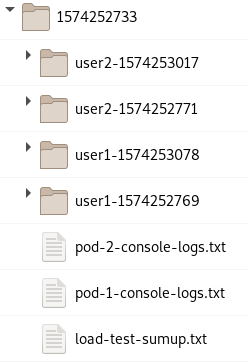
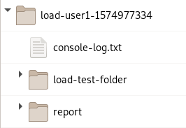

# Load tests

Load tests should test the behaviour of server when users will start workspace at once. 

## Prerequisites
Test itself is just creating a load so there are some steps that need to be done before running load tests.
What do you need to run those tests
- `oc` client, `jq` and `tar` installed
- cluster with running Che/CRW
- cluster where load tests pods will be executed (can be the same cluster where Che/CRW is deployed)
- users created on a Che/CRW (see 'How to create users' below)

### How to create users
Users can be created manually, but there is a script `create_users.sh` to create users automatically.
#### Creating users via script
Log in via oc to the server and namespace, where the Che/CRW is running.
Type `create_users.s -h` to see how to run the script. The script will generate users based on `base part of username` and will add an increment to that.
```
-n    base part of username (e.g. 'user')
-p    common password
-s    starting index of a users (generated name will look like e.g. 'user1')
-c    number of users that should be created
-e    tested environment - can be Che or CRW
```
Examples:
The Che is running without any users created yet. 5 users can be created here by this command:
```
./create_users.sh -n user -p pass123 -c 5 -e Che -s 1
```

There are 5 users created `user1`, `user2`, `user3`, `user4`, `user5`. All users have common password `pass123`. 
Now 5 users exist and can be used for load tests. Let's add another 10!
```
./create_users.sh -n user -p pass123 -c 10 -e Che -s 6
```
New users `user6`, `user7`, ..., `user25` are created.

## Running load tests
The command `./load-tests.sh -h` can be executed to give a help with setting up all required parameters.

### Setting up users
There are two ways how to tell the load tests which users to use. Users can be written in .csv file in format `user,password`. Use `-c <my_file_with_credentials>.csv` to use all users in your file.
The second way is usable when username are composed in format `<username><increment>`. To use that approach set those parameters:
```
-u    base username
-p    common password
-n    number of users 
```
Please note that currently it is not possible to start from another index then 1. 

Example:
Let's consider Che with 15 users created in format `user1`, `user2`, etc. and with password `pass123`. Then the setting of those values would be: `-u user -p pass123 -n 15`.

**Additional parameters**
There is non mandatory parameter that can be used:
`-t` defines how many workspaces will user create in a row. Default value is one. That basically means that whole test flow will be run again - so only one workspace will run at one time.

### Other parameters
`-i` sets the image that include test. This image is used as a base image for a pods where test runs.
`-r` Che/CRW url where user can log in.
`-f` full path to folder where logs and reports should be saved

## Results and logs
Once tests are done, logs and reports are copied from the pods to the local folder specified by `-f` flag. The structure looks like this:



Each time the test is run, new folder with timestamp as its name is created. All files are saved in this folder. 

## User folder
Each user has own folder with logs which is named in a way `<username>-<timestamp>`. The timestamp is a time when this particular user test was started. If tests succeed, there are console-log.txt and load-test-folder in user folder. In load-test-folder there is just one file load-test-results.txt with test names and time taken by those tests.
If tests fail, there is also another folder called report. There are screenshots and logs from the failed test so it should be easier to understand what happened.



## Pod conole log files
For each running pod there are logs gathered in a file `pod-<number_of_pod>-console-logs.txt`. Please note that if you set `-t` larger then 1, this pod console log contains logs only from the last run. 

